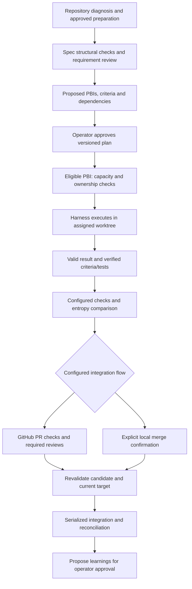

# Product Requirements Document — Gantry v4

## Project: Gantry — The Autonomous Software Factory Engine

**NPM package:** `gantry`

**Execution:** `npx gantry <command>`

**Version:** 4.0.0 (breaking redesign — supersedes 3.2.0)

**Status:** Product decisions consolidated; implementation contracts and Windows validation pending (§14). This document specifies intended behavior, not an implemented or verified product.

**Harness compatibility:** Agnostic (Host harness, Detached CLIs / Subscriptions, Gateways/Routers, Direct APIs, MCP Server)

**Runtime and initial project support:** Gantry itself is implemented and distributed as a TypeScript/Node.js npm package and is invoked through `npx`. The first project adapters target TypeScript/JavaScript and Python repositories. Python is not a runtime dependency of the Gantry engine; Python tooling is invoked only when the repository's approved checks require it. The initial version uses Git locally or GitHub Pull Requests as its version-control integration modes. These choices do not claim universal language analysis or unconditional operating-system support; adapter and platform capabilities must be tested and recorded.

**Initial harness validation:** Codex and OpenCode are the two validation targets for the first release. Both must exercise the same end-to-end acceptance scenarios for planning, dispatch, valid and invalid results, gates, handoff, interruption, reconciliation, and explicit resumption, with guarantees limited to each integration's demonstrated capabilities. Other harnesses mentioned in examples are compatibility candidates rather than verified support until they pass the applicable conformance scenarios. Tested versions and observed capabilities must be recorded.

**Cross-harness acceptance:** initial validation includes four combinations: Codex coordinating native Codex agents; OpenCode coordinating native OpenCode agents; OpenCode coordinating a role executed through the detached Codex CLI; and Codex coordinating a role executed through the detached OpenCode CLI. Both cross-harness directions must demonstrate approved role routing, GTP dispatch and result validation, traceability to the actual driver, and applicable failure, handoff, and resumption scenarios. A successful native-only run does not establish cross-harness support. Record capability limitations per combination and reject unsupported operations rather than claiming an unverified guarantee.

**Control boundary:** the host harness directs execution; Gantry validates workflow transitions and authorizes its own integration operations. Monitoring and interruption depend on demonstrated integration capabilities. See [ADR-0001](docs/adr/0001-harness-first-control-boundary.md).

---

## 1. Product purpose

Gantry is the factory infrastructure operated by a coding harness. The operator prepares the repository and approves a spec and PBI breakdown; the harness coordinates agents while Gantry validates protocol transitions, evidence, and integration.

The gantry-crane metaphor describes support and coordination: work happens in isolated PBI worktrees, evidence is checked before integration, and handoffs preserve continuity within the integration's available capabilities.

---

## 2. Executive Summary & Design Philosophy

### 2.1 The Five Critical Bottlenecks of Vibe Coding

1. **Context Rot & Cognitive Degradation:** LLMs lose logical precision as context grows; accumulated logs cause *attention dilution* and hallucinations well before the window limit.
2. **Ineffective Horizontal Slicing:** Layer-by-layer task splitting ("all endpoints, then all DB") forces the whole application into memory, generating colossal diffs and conflicts.
3. **Invisible Architectural Debt:** Code that passes point tests but introduces forbidden coupling and layer violations.
4. **Application Security Risks (AppSec):** Agents generating code vulnerable to SQL injection, missing access control, or secret leakage.
5. **Economic Provider Lock-in:** Tools requiring paid per-token API keys, ignoring existing harness authentication and subscription arrangements or configured gateways.

### 2.2 The Four Pillars of Gantry v4

**Pillar 1 — Harness-First Orchestration.** Everything starts and runs *inside* the operator's harness (opencode, Claude Code, Codex). The harness agent is the orchestrator: it drives the flow through Gantry's capabilities — skills, internal CLI, internal MCP tools — and spawns subagents natively (same harness) or cross-harness CLIs (different harness). Gantry is not a competing orchestrator; it is the factory the harness operates.

**Pillar 2 — Global Factory, Conversational Setup.** Gantry is installed **once per machine** (`~/.gantry` central factory + skills in `~/.agents`, symlinked into every installed harness) — not reconfigured per repository. Setup is conversational: the harness LLM interviews the user and writes config; no manual JSON editing by default. Repository-specific policy reuses existing conventions; global execution state lives in SQLite.

**Pillar 3 — Agents + Code > Agents Alone.** Deterministic code owns the guardrails: validation, gates, watermark checks, telemetry, merge policy. Because the orchestrator is now an LLM, determinism shifts from *executing* the loop to *validating every transition* — a step performed out of order or skipped is rejected at the protocol boundary, not at process spawn.

**Pillar 4 — Structured Communication, Not Conversations.** Agents never talk to each other in free text. Every invocation is a transaction: a schema-validated **task envelope** in, a schema-validated **result envelope** out (GTP, §5), enforced by deterministic checks, audited in SQLite.

### 2.3 Accessibility Doctrine (new in v4)

The #1 adoption blocker of agent-orchestration tools is setup complexity. Gantry v4 commits to:

1. **Zero-config demo, readiness-aware onboarding:** the demo runs without repository preparation or credentials. For a real repository, `gantry init` uses sensible defaults where appropriate, diagnoses readiness, and makes missing preparation and required operator approvals explicit; defaults never substitute for approval or required verification.
2. **Global, conversational setup:** `gantry setup` installs the machine-level factory and skills once; `gantry init` (inside a harness) is driven conversationally by the harness LLM.
3. **Demo mode:** a user can watch a full pipeline (spec → slices → build → gates → merge) on a fixture project with stub agents — no API keys, under 2 minutes.
4. **Progressive disclosure:** docs layered as quickstart (3 commands) → cookbooks → deep reference (this PRD last).
5. **Settings screen** in the dashboard as the visual fallback for users who prefer forms over conversation.

---

## 3. Global System Architecture

### 3.1 Workflow and control boundaries



Failures, requested changes, handoffs, cancellation, and resumption use the same operation core and state machine (§8.1). Corrections are bounded (§6.2). Review waiting releases execution capacity when no active work remains. Cleanup is a separate approved action (§6.1).

The harness orchestrates; CLI, MCP, and dashboard expose Gantry operations. A valid result alone does not authorize integration.

### 3.2 Directory Layout: Global Factory + Repository Artifacts

```text
# Machine scope — created once by `gantry setup`
~/.gantry/
├── gantry.sqlite                  # Global telemetry DB (WAL), rows scoped per repository
├── config.json                    # Global defaults: host, roles, drivers, context limits
└── bin/ · mcp/ · dashboard/       # CLI, MCP server, dashboard assets
~/.agents/skills/gantry-*          # Source-of-truth skills (symlinked into detected harnesses:
                                   #   ~/.claude/skills, .opencode, ~/.codex, …)

# Repository scope — created/ensured by `gantry init` (inside a harness)
# Example fallback layout; existing canonical locations are mapped instead (§6.3).
my-project/
├── AGENTS.md                     # root instructions; marked Gantry section created or merged
└── .gantry/
    ├── config.json                # OPTIONAL sparse repo overrides (merged over global config)
    ├── CONSTITUTION.md            # ensured: architectural invariants (English, generated)
    ├── context-map.json           # high-density graph of the codebase
    ├── state/
    │   ├── messages/              # GTP envelopes: {message_id}/task.json + result.json
    │   └── handoffs/              # compaction memos (PBI-001-handoff-1.json)
    ├── specs/                     # Living Specs (permanent source of truth)
    ├── adrs/                      # Architectural Decision Records
    ├── pbis/                      # Atomic vertical-slice backlog
    ├── learnings/                 # Compound Loop candidate rules
    └── prompts/                   # Prompt templates with bash interpolation (!```cmd```!)
```

---

## 4. Context Governance and Vertical Slicing

### 4.1 Context watermark

**Context policy:** 40% of the configured model's nominal window is the default handoff watermark. It is an operating policy, not a scientific threshold proving loss of reasoning quality. Monitoring and interruption depend on explicitly supported integration capabilities. A strict ceiling may only be claimed when the integration can enforce it; checks between turns and self-reported usage alone do not establish that guarantee. The host harness coordinates native subagent handoffs, while Gantry validates workflow transitions. Agent-initiated handoffs remain additional triggers. The precise capability contract and measurement rules remain to be specified.

### 4.2 Upstream Vertical Slicing

Rules:

1. **End-to-End:** deliver a narrow, complete, independently verifiable behavior across the layers relevant to that feature. Route → validation → service → repository → test is an example, not a required architecture for every repository or tooling change.
2. **Estimated Initial Budget 15%:** estimate the complete initial context package against the configured model's nominal window, including instructions, spec/PBI content, contracts, governance context, source files, and other injected material. Record the estimation method, assumed window, and uncertainty margin; distinguish estimates from observed usage. If the estimate exceeds 15%, reduce the slice and reassess before approval or dispatch, following the plan amendment policy when decomposition changes. This is a planning budget, not a claim of exact runtime measurement or a universally enforceable context ceiling. Token estimation and uncertainty calculation remain to be specified.
3. **Verifiability:** the slice defines executable checks for its acceptance criteria. Test duration alone is not a reason to reject a slice; there is no mandatory ten-second limit.
4. **Explicit dependencies:** slicing declares prerequisite PBIs. A dependent PBI cannot start implementation until every prerequisite is integrated into the applicable target branch; completed implementation, green gates, or an open PR alone do not satisfy a dependency. The dependent starts from an updated base that includes those integrations, subject to the repository's Git workflow policy. Only PBIs with satisfied dependencies are eligible for parallel implementation. Stacked branches and stacked PRs are out of scope for v4; dependency schema and validation rules remain to be specified.

### 4.3 State Compaction Protocol (Subagent Handoff)

```text
[ Handoff triggered: 40% watermark OR agent status needs_handoff ]
                │
                ▼
1. git diff → local save-point
                │
                ▼
2. Deterministic `compact_handoff_memo()`:
   - Save: .gantry/state/handoffs/{pbi_id}-handoff-{n}.json
   - Discard: raw conversation history, tool calls, build logs
   - Keep: remaining criteria, last failing error, modified files
                │
                ▼
3. Reconcile and stop or hand off the current agent through supported integration capabilities
                │
                ▼
4. Start a fresh subagent through the configured integration with:
   GTP task envelope + compiled memo + touched files
                │
                ▼
[ Ralph Loop resumes from validated continuity context ]
```

**Handoff memo structure (`handoff-memo.json`):**

The replacement agent uses the same estimated initial context budget as any PBI start (§4.2): at most 15% of the configured model window for the complete package, including the handoff memo. There is no separate 5% requirement or guarantee of restored reasoning quality. Preserve the required contracts, criteria, governance, and continuity evidence; if the package exceeds the budget, pause for context or decomposition review instead of dropping mandatory information. Changes to the approved plan remain subject to operator approval.

```json
{
  "pbi_id": "PBI-002-redis-lock",
  "handoff_index": 1,
  "timestamp": "2026-09-10T03:45:00Z",
  "trigger": "watermark_40_pct",
  "token_usage_at_handoff": 51200,
  "context_percentage": 0.40,
  "completed_criteria": [
    "Lock table schema created via migration",
    "Connection unit test passing"
  ],
  "pending_criteria": [
    "Release lock via TTL with idempotent key",
    "Guarantee HTTP 409 response when the lock is active"
  ],
  "last_failing_error": "AssertionError: Expected 409 to equal 409, received 500 (UnhandledLockTimeout)",
  "active_modified_files": [
    "src/modules/billing/locks.service.ts",
    "src/modules/billing/locks.service.spec.ts"
  ]
}
```

---

## 5. GTP — Gantry Task Protocol (v1)

The formal communication contract between the orchestrating harness agent, its subagents, and cross-harness agents. All envelope traffic is **hub-and-spoke through Gantry's CLI/MCP registrar** — envelopes never travel agent-to-agent. The harness orchestrates; Gantry issues task envelopes, validates result envelopes, and records every transition. This replaces free-form stdout inference as the semantic channel, while exit codes, git state, and token telemetry remain the *enforcement* sources.

### 5.1 Task contracts

**Role-specific contracts (normative):** GTP uses shared protocol, execution, assignment, role, and correlation identities with role-specific payloads. Each dispatch references the approved PBI/spec and rule versions, constraints, input context, and required output contract. Validate both the common layer and the current role's contract.

| Role | Task content | Required result content |
|---|---|---|
| Builder | Criteria, approved verification, allowed scope, continuity context | Completed/pending criteria, revision and verification evidence, reported changes, status |
| Requirement critic / adversarial critic | Versioned subject, applicable rules and available findings | Findings, review coverage/evidence, status |
| Slicer | Technically ready spec, stories and context budget | Proposed PBIs, criteria, story coverage, dependencies and estimates |
| Other roles | Inputs specific to the approved operation | Role-specific outputs and evidence |

These are contract requirements, not final JSON schemas. A builder result cannot satisfy a review or slicing assignment. Required identities and version bindings must be present before dispatch.

### 5.2 Results, continuity, and retention

Results carry the task correlation and a distinct submission identity, role-specific status and evidence, operator questions when blocked, and handoff reason when needed. Unknown context usage must be representable without inventing a measurement.

The dispatch payload may contain the full approved context needed for execution. Its retained audit representation follows redaction and retention (§6.2): references, hashes, and safe summaries by default. Local handoff continuity includes remaining criteria, modified-file references, and the relevant failure, without duplicating raw history. A retained record must identify where the required versioned content can be obtained; a missing source must be reconciled before resumption.

Exact schemas and persistence details are implementation deliverables (§14), including immutable submissions and receipts.

### 5.3 Status Semantics (normative)

| status | Meaning | Ralph loop action |
|---|---|---|
| `complete` | Agent reports completion; for a builder, all PBI criteria must be met and mandatory tests must pass on the delivered revision | validate completion evidence; only then finish implementation and advance to quality gates |
| `failed` | Role-specific work failed; for a builder, required verification failed | record evidence; schedule correction only within the remaining applicable budget |
| `needs_handoff` | Agent requests fresh execution context | coordinate handoff under supported capabilities and reconcile ownership |
| `blocked` | Cannot proceed; `questions_for_operator` non-empty | stop loop, step `blocked`, surface questions, exit non-zero |

Status precedence per valid result: `blocked` > `needs_handoff` > completion evaluation. Exit codes are verification evidence, never a substitute for a valid result.

**Builder completion (normative):** Gantry accepts implementation completion only when the result is valid, all criteria from the assigned PBI are accounted for as completed, no criteria remain pending, and Gantry verifies that all mandatory PBI tests pass on the delivered revision. Agent claims alone do not establish completion. A green test run with unfinished criteria, or completed criteria with missing or failing mandatory tests, cannot complete implementation. The evidence format and criterion verification rules remain to be specified.

Implementation completion advances the PBI to quality gates; it does not authorize merge. Merge authorization still requires the applicable gates to pass.

### 5.4 Enforcement & Compatibility Invariants

1. **Result required for advancement:** a missing or malformed `result.json` is a protocol failure. Preserve the agent's work and record the failure for recovery, but do not advance the workflow, mark the PBI complete, or authorize its merge until a valid result is received and the applicable deterministic checks pass. Process exit code 0 alone is insufficient; legacy exit-code inference cannot substitute for a valid result. Recovery mechanics and retry limits remain to be specified.
2. **Verification sources:** actual check results and Git/provider state take precedence over agent claims. Context telemetry is authoritative only to the extent supported by the integration; unavailable measurements remain unknown, not zero or implicitly verified.
3. **Append-only:** iteration N never overwrites iteration N-1 envelopes; every dispatch and result is also a telemetry event.
4. **Governance protection:** resolve protected paths from the repository's effective artifact mapping. Ordinary assignments cannot change constitution or ADR content. When approved work explicitly changes governance, use the baseline-transition and plan-amendment policies (§7.2, §7.5); an unconditional path prohibition must not prevent the approved transition.
5. **Schemas are Zod-validated** at the boundary; unknown fields are preserved (forward compatibility).
6. **Current execution ownership:** within a repository execution unit, a PBI has at most one active execution owner across harness sessions. Each dispatch carries an identity identifying the current execution and assignment; result validation must check that the assignment remains current before changing execution state. Results from superseded assignments are retained for audit but cannot advance the workflow or authorize merge. A takeover or resume must reconcile the prior agent before claiming the PBI and must not assume that superseding an assignment stopped the old agent. Ownership arbitration, assignment schema, and prevention of concurrent worktree writes during takeover remain to be specified.

Protocol validation precedes the status semantics in §5.3. A missing or invalid result is not an agent-reported `blocked` result and does not require `questions_for_operator` to record the protocol failure. Its persistent state representation remains to be specified.

**Idempotent result submission:** assign each result submission a stable identity within its execution and dispatch context, distinct from the task's correlation identity. A repeat of an already accepted submission with identical content returns the original receipt without repeating transitions, counters, events representing new acceptance, or downstream dispatches. Different content under the same submission identity is rejected. A corrected result requires a new submission identity linked to the previous attempt, preserving history; this does not bypass current-assignment checks, role validation, or allowed state transitions. Submission identity fields, content comparison, receipts, and atomic acceptance mechanics remain to be specified.

---

## 6. Universal Harness Layer: Host, Routing & Drivers

### 6.1 Orchestration Model & Invocation Adapters

**The orchestrator is the operator's harness agent** (opencode, Claude Code, Codex) — it drives the workflow through Gantry's capabilities: skills installed in `~/.agents`, the `gantry` CLI, and the `gantry mcp` server. Gantry never competes for the orchestration loop; it provides rails. Three invocation adapters cover every role:

* **Native subagent (same harness):** the harness spawns its own subagent; Gantry hands it a GTP task envelope (via skill/MCP) and validates the result. Gantry does not spawn a replacement CLI for a native assignment; actual session and authentication behavior must be verified per integration.
* **Detached CLI (cross-harness):** Gantry's CLI/MCP spawns another harness's CLI (e.g. `codex exec` for the adversarial critic while building inside opencode). Deterministic, per-role binary.
* **Gateway (OpenAI-compatible):** single-shot HTTP for router/proxy setups; never for file-mutating roles.

Each integration must explicitly identify its context-monitoring and agent-interruption capabilities. Native subagent execution remains under the host harness's control; Gantry does not acquire lifecycle control merely by exposing CLI or MCP tools. Execution guarantees must reflect the capabilities actually available, while transition validation and Gantry merge authorization remain Gantry's responsibility.

**AFK lifecycle (v4):** autonomous workflow progression requires the host harness to remain active. Gantry does not provide a background service that takes over orchestration after the harness closes. Persist progress so the operator can explicitly resume after reopening the harness. Before continuing, reconcile pending agents and operations against observed state, including uncertain external effects under §7.6; do not assume that closing the harness stopped detached processes or prevented an already requested operation from completing. Resumption preserves correction counters and existing work and does not authorize speculative duplicate dispatch. Resume commands, persistence checkpoints, and pending-agent reconciliation mechanics remain to be specified.

**Cancellation (normative):** an operator cancellation stops new dispatches and progression, marks the execution cancelled, and triggers reconciliation of active agents and pending external operations. Preserve worktrees, branches, envelopes, reports, approvals, and execution evidence for explicit resumption, inspection, or later cleanup. Cancellation does not automatically delete artifacts, close or delete Pull Requests, revert commits, reset branches, or undo other external mutations; each such action requires a separate explicit decision after authoritative state is known. A cancelled execution cannot resume implicitly, and resumption reconciles and reacquires current ownership while retaining budgets and the rule snapshot unless explicitly amended. Cancellation state, agent-stop capabilities, and cleanup commands remain to be specified.

**Cleanup authorization (normative):** worktree and branch cleanup is a separate explicit action after merge, cancellation, or failure. Before removal, show the exact local paths, branches, provider objects, and evidence affected, verify that no active execution or unresolved operation depends on them, and require operator confirmation. Gantry must not automatically delete worktrees, branches, Pull Requests, reports, envelopes, handoff memos, or audit evidence. Cleanup must preserve the minimum records required to explain the execution and its external effects; retention and safe cleanup mechanics remain to be specified.

The **host** identifies the active harness integration. Explicit integration metadata (including `GANTRY_HOST_COMMAND` where supplied) and configured host information must be validated against the approved driver and capabilities. A parent process name or environment variable alone does not provide access to native subagent APIs.

### 6.2 Unified Configuration (`~/.gantry/config.json` + repo overrides)

The configuration contract covers host and role routing, context estimates, concurrency, correction and infrastructure budgets, Git workflow, artifact locations, verification commands/resources, data handling, and dashboard access. These settings are governed by the policies below. Final field names and validation schemas belong to the implementation design; an executable-looking partial JSON example is not the contract.

#### Runtime policy and versioned governance

**Config layering:** global defaults live at `~/.gantry/config.json` (written by `gantry setup`, editable via dashboard Settings); a repository may add a sparse `.gantry/config.json` with overrides. Effective config = built-in defaults ← global ← repo override, merged and validated as one document by the shared `ConfigStore`.

**Concurrency limits:** the factory has a configurable global limit of two concurrently executing PBIs by default, with configurable repository and driver limits. Dispatch is permitted only when all applicable capacity limits, dependency readiness, execution ownership, and check-resource constraints allow it. Repository or driver settings do not bypass the global capacity limit. Queued PBIs wait for capacity rather than spawning work above the limit; parallelism may be lower than configured when dependencies or shared resources require serialization. Limit accounting, driver capacity units, waiting-state slot release, and scheduling fairness remain to be specified.

**Review waiting capacity:** a PBI waiting for human review releases its execution slot once no agent or operation remains active. Preserve its worktree, evidence, and persisted execution state; releasing capacity does not cancel the PBI or discard its history. Other eligible PBIs may use the released capacity, while dependents remain ineligible until the prerequisite is integrated. Before the waiting PBI resumes active work, reacquire the applicable capacity and revalidate current state and integration prerequisites. Detailed polling and slot accounting remain to be specified.

**Execution rule snapshot:** at execution start, retain a fixed snapshot of the resolved configuration and applicable governance documents, including the constitution and ADRs. Subsequent edits apply to new executions and must not silently change the rules of an in-flight or resumed execution. Applying updated rules to an existing execution requires explicit operator action, records the rule change, invalidates affected approvals, and revalidates the work before advancement. Preserve which rule version governed each validation and delivery. This snapshot does not override live repository protections or permit use of stale target revisions; those still require current verification under §7.6. Snapshot storage, identity, and rule-change commands remain to be specified.

**Governance precedence (normative):** when applicable rules disagree, resolve them in this order: (1) provider protections and absolute security requirements; (2) the approved execution rule snapshot; (3) `CONSTITUTION.md`; (4) applicable ADRs; (5) approved spec and PBIs; (6) `AGENTS.md` and operational configuration. A lower-precedence document cannot relax a higher-precedence invariant or gate. Any conflict that cannot be resolved by this order blocks the affected transition and must be surfaced as a proposed governance or plan amendment; an agent may not choose silently. The snapshot selects the approved versions of these documents; it is not a separate text that can authorize violations of its own captured rules. Changes to precedence require explicit governance approval.

**Correction limit:** a global setting defines the maximum correction attempts per PBI, defaulting to five. This is a shared policy value applied independently to each PBI, not a machine-wide pool of attempts. The initial gate evaluation consumes no attempt. One correction attempt is a cycle of correcting findings followed by revalidation; all gates of a PBI share the same budget, rather than receiving five attempts each. Persist the counter across agent handoffs and execution resumes. If the gates still fail after the fifth correction attempt, the gate fails, automatic correction stops, and merge remains prohibited. Further correction requires explicit operator intervention to grant additional attempts; resuming or replacing an agent must not implicitly reset the budget. Separate handoff and elapsed-time limits are not established by this decision. Accounting for interrupted correction cycles remains to be specified.

**Infrastructure retries:** an infrastructure failure, such as temporary network unavailability preventing a critic evaluation, permits up to three automatic retries after the initial failed execution, with progressively increasing waits. These retries have a separate budget and do not consume code correction attempts. If the failure persists, execution becomes blocked for resumption; the gate remains unapproved and merge is prohibited. This operational block is distinct from an agent-reported `blocked` result and does not require an operator question from the agent. Operations with uncertain effects must first follow reconciliation in §7.6; the retry budget is not permission to repeat an unverified mutation. Failure classification, backoff intervals, and retry accounting on resumption remain to be specified.

#### Git workflow and provider policy

**Git workflow policy:** initial configuration includes the user's preferred Git workflow so Gantry knows how to create PBI branches and Pull Requests. `gantry setup` captures global preferences; `gantry init` resolves the effective policy for the repository and allows repository-specific overrides. The policy covers branch naming, the branch from which new PBI branches start, the integration target / PR base, and local merge or Pull Request delivery with required checks and approvals. Gantry must respect repository protections rather than bypass them. Supported workflow presets, default behavior when the user skips this choice, and the exact configuration schema remain to be decided. Examples using `main` or `pbi/{id}` illustrate defaults, not universal requirements.

**Git provider support (v4):** GitHub is the sole supported Pull Request provider for creation, checks and approval lookup, merge, and reconciliation. The initial integration targets both GitHub.com and GitHub Enterprise through the authenticated `gh` workflow; deployment-specific behavior remains pending validation. Git local mode supports integration without a Pull Request provider. GitLab, Bitbucket, and Azure DevOps integrations are deferred. Isolate provider-specific behavior behind an integration interface so additional providers can be added later; do not present unsupported providers as operational choices or silently substitute local merge for their PR workflows.

**GitHub authentication (v4):** use credentials already configured in the environment, using an authenticated `gh` installation or a token referenced by an approved environment variable for GitHub API operations, and existing SSH credentials where applicable to Git transport. SSH access alone does not authorize GitHub API operations. Gantry must not copy or persist credential values in configuration, SQLite, envelopes, dashboard output, or repository artifacts. During readiness, detect the available identity and provider/repository access, show which identity and authorization scope will be used, and require approval before the first mutating GitHub operation. Local authentication proves identity only; it does not imply authorization for every repository or operation. Missing, ambiguous, expired, or insufficient credentials block the operation and require reconciliation or operator action. Credential detection, scope verification, and GitHub deployment variants remain to be specified.

**Provider protection authority (normative):** for a GitHub Pull Request workflow, the actual protection rules and required checks/approvals of the configured target branch are authoritative for integration. During readiness and before mutation, compare observed provider protection with the effective Git workflow policy and execution rule snapshot. A missing, weaker, or divergent protection blocks the workflow until the operator adjusts the policy or provider configuration and affected validations are rerun. Local configuration cannot compensate for disabled or weaker provider protection, and Gantry must not bypass provider rules or silently fall back to local merge.

**Pull Request observation (v4):** monitor GitHub Pull Request checks, reviews, mergeability, and protection state through authenticated polling. Intervals, backoff, and an observation budget are configurable and recorded. Each observation is reconciled against the PR identity, target revision, candidate revision, and current provider protection. Reaching the observation budget leaves the execution waiting for resumption; missing updates, timeouts, or an unavailable provider never count as approval or passing checks. Webhooks and externally hosted callbacks are deferred. Polling mechanics and rate-limit handling remain to be specified.

**Git workflow scope (v4):** Gantry automates PBI branch creation, Pull Request preparation, and integration into the configured target. Release orchestration, promotions between long-lived branches, and hotfix lifecycle automation are explicitly out of scope. Understanding a repository's workflow does not imply automating its entire release lifecycle; integration into a branch such as `develop` does not imply promotion to `main` or publication of a release. The Gantry package's own release engineering in §12 is separate from this product scope.

Resolve each role from its approved execution snapshot. A `host` role uses the validated active host integration; explicit environment metadata is a discovery input, not permission to override the snapshot or egress policy. Missing or conflicting resolution blocks dispatch with setup guidance. File-mutating roles (`builder`, `merger`) cannot route to a single-shot gateway.

**Driver unavailability:** if the configured driver becomes unavailable, preserve work and follow the applicable bounded infrastructure retry policy. When permitted retries are exhausted, block progression; do not automatically substitute another harness, model, gateway, or endpoint. A replacement requires explicit operator action to update the execution rule snapshot, verify capabilities and data egress authorization, and invalidate affected validations under the existing rule-change policy. Before replacement dispatch, reconcile the prior assignment and any uncertain operations so driver failure does not produce duplicate work or mutations. Permanent configuration or authorization failures require correction rather than speculative retries.

#### Data handling and execution boundaries

**Security invariants:** no secret ever lives in the config file (keys referenced by env-var name only); every spawned subprocess records its resolved driver and model in telemetry, so the dashboard always shows *which* harness did what; config writes go through one validated `ConfigStore` shared by CLI, dashboard and MCP.

**Data egress policy (normative):** repository onboarding declares, per role and driver, whether specs, diffs, source context, reports, prompts, or other repository content may leave the local execution environment. It identifies approved host harnesses, detached CLIs, gateways, endpoints, models, and any content restrictions. The policy is approved per repository and captured in the execution rule snapshot. A role may use only an allowed driver and payload class; Gantry must not silently route a disallowed role to an external API or include content beyond the approved payload. Secrets remain prohibited regardless of egress approval. Missing, ambiguous, or unavailable egress authorization blocks dispatch; local processing remains available when explicitly configured. Egress declaration, payload classification, provider identity, and enforcement mechanics remain to be specified.

**Output redaction (normative):** before any command, agent, provider, or harness output is persisted to SQLite, GTP envelopes, handoff memos, dashboard feeds, or repository artifacts, apply the configured redaction pipeline. Never persist or display secret values, credentials, bearer tokens, private keys, signed URLs, or other configured sensitive material. Preserve only safe summaries, references, and redaction metadata needed for audit. If output cannot be redacted with sufficient confidence, do not persist or display it in full; mark the relevant operation or check blocked for review. Redaction must also cover error paths and retained audit records; absence of a detected secret is not proof that arbitrary output is safe. Redaction rules, secret sources, and confidence behavior remain to be specified.

**Telemetry retention (normative):** by default, SQLite, GTP records, handoff memos, dashboard feeds, and generated artifacts retain references, hashes, timestamps, identities, statuses, redacted summaries, and evidence metadata rather than complete diffs, prompts, source files, or build logs. Full content remains in the relevant worktree or provider where available. Per-repository configuration may explicitly enable detailed retention, subject to output redaction and cleanup authorization; the setting is captured in the execution rule snapshot. Retention settings must not cause secrets to be stored, and changing them invalidates any affected evidence that depends on retained content. Exact retention fields and redacted-summary rules remain to be specified.

**Deferred (explicitly out of v4):** harness-specific conversation continuation as a cost optimization. This does not defer identifying and reconciling current agent assignments, which is required for ownership and resumption.

### 6.3 Global Installation, Skills & the User Factory (`gantry setup`)

Gantry is installed **once per machine**, not per repository:

```bash
npm install -g gantry   # installs the CLI globally (npx gantry setup also bootstraps this)
gantry setup            # conversational bootstrap of the user factory
```

`gantry setup` provisions:

* **`~/.gantry/`** — the central user factory: global `config.json`, `gantry.sqlite` (WAL, repo-scoped rows), CLI, MCP server, dashboard assets.
* **Skills** — installed at `~/.agents/skills/gantry-*` (spec authoring, vertical slicing, run-pbi, gates, merge, setup helper), then **symlinked into every detected harness** (`~/.claude/skills`, `.opencode`, `~/.codex`, …). Where symlinks are unavailable (e.g. Windows without dev mode), Gantry falls back to copies and records the divergence in telemetry-free local state.
* A **harness compatibility matrix** maps each skill format to each harness's convention; unsupported harnesses get CLI/MCP access only, with a printed notice.

Per repository, `gantry init` (run inside the harness) does **provisioning, not configuration-from-scratch**: ensures `.gantry/` workflow artifacts, **ensures `AGENTS.md`** (creates a minimal version carrying the Gantry ASDLC workflow guidance, or merges a clearly-marked `<!-- gantry:begin -->` section into an existing file — never overwrites), ensures `CONSTITUTION.md`, verifies required skills are available, and writes only repo-level config overrides.

**Repository readiness (normative):** the repository onboarding phase (`gantry init`, separate from machine-level `gantry setup`) inspects existing instructions, documentation conventions, tools, and directory layout. It identifies the required Gantry workflow sections in the root `AGENTS.md`, locations for specs and PBIs, documentation and ADR directories, and governance artifacts. It presents missing sections and adjustments and ensures the required structure is provisioned, preserving existing instructions through the marked Gantry section. The operator must be able to understand and supply repository-specific rules rather than receiving an unexamined generic template.

**Existing repository conventions:** reuse canonical locations already established by the repository, including conventions installed by other skills. Detect the existing mappings, present them during onboarding, and persist the effective artifact locations. Create default locations only for artifact categories without an existing convention; do not move or duplicate canonical documents merely to match Gantry's fallback layout. For example, a repository may use `docs/adr/` for ADRs and `.scratch/<feature>/spec.md` with `.scratch/<feature>/issues/` for specs and slices. Authoring, linting, context loading, governance protection, and execution must all use the same effective mapping; example `.gantry/specs/`, `.gantry/pbis/`, and `.gantry/adrs/` paths are not hard-coded requirements. Detection rules and mapping schema remain to be specified.

Onboarding also detects existing verification tools and proposes the repository's mandatory test, architecture, and security commands. Validate their execution and record what each check actually covers. A required check that is missing or cannot produce valid evidence prevents readiness for governed execution. Findings are evaluated under §7.5: preexisting differential debt is not equivalent to a broken tool, while mandatory absolute failures remain blocking. Gantry coordinates and records these explicit checks rather than treating a generic claim of ADR or security coverage as verified. The readiness report format, supported detectors, and exact required instruction sections remain to be specified.

Repository readiness also detects or asks for the repository's dependency and license policy. Required license checks become approved mandatory checks with structured evidence. Existing findings remain visible under the entropy gate's differential policy; a new dependency, license, or license change that violates the approved policy blocks the delivery. License policy changes are governance baseline transitions and require the same comparative analysis and approval as other check changes.

**Verification command approval (normative):** before executing a detected or newly proposed verification command for the first time, show the exact command, working directory, relevant environment variables, declared effects, and expected report. Require explicit operator approval. Bind the approved command and its resolved configuration to the execution rule snapshot; a command or configuration change invalidates evidence produced by the prior version and requires reapproval and revalidation. Detection may be automatic, but execution of a new or changed command may not be implicit. Secret values must not be displayed or persisted; only approved environment-variable references are recorded.

**Missing verification tooling:** when required verification tooling is absent, onboarding prepares a concrete proposal identifying the tools, dependencies, configuration changes, and checks needed for that repository. The operator approves this preparation before it is applied. AFK implementation remains unavailable until the approved preparation is complete and required checks are installed, configured, and executable, with the reports required for entropy comparison available. Completing scaffolding or accepting a proposal alone does not establish readiness or gate approval. Preparation mechanics and supported tool presets remain to be specified.

**Preparation authorization (normative):** approval of missing-tooling preparation authorizes only the explicitly listed commands, files, dependency changes, and expected effects in that proposal. Gantry may apply the approved preparation, then verify the resulting repository readiness. If execution discovers additional changes, dependencies, or effects outside the approved proposal, it must pause and present an amended proposal for approval; it may not expand scope implicitly. Preparation changes remain subject to repository execution identity, command approval, and plan/governance rules.

### 6.4 Dynamic Bash Prompt Resolution (Matt Pocock Pattern)

Prompt templates may request approved context commands through `!```command```!` syntax. Compilation uses the command-approval and egress policies in §6.3/§6.2; template text alone cannot grant execution permission. Outputs are bounded by context policy and redacted before retention. For example:

```markdown
# Vertical Slice Audit
Analyze the changes made by the PBI branch against the base branch:
!```git diff origin/main...HEAD```!
```

---

## 7. Skills, Quality Gates & LLM Reviewers

### 7.1 `gantry setup` + `gantry init` — Conversational Bootstrap & Repo Provisioning

§6.3 owns the onboarding requirements: machine setup, repository diagnosis, approved preparation, artifact mapping and verification configuration. Git workflow preferences come from §6.2 and remain independent of the harness preset.

`gantry init --demo` uses a fixture and stub agents for the under-two-minute demo. It must not mutate a user's real project to demonstrate integration; demo controls exercise fixture operations. The UI must identify simulated evidence and approvals so demo results are not mistaken for production readiness.

Presets (first-class): `claude-only`, `opencode-host`, `opencode-host+codex-critic`, `gateway`, `demo`.

### 7.2 `spec-quality-linter` (`gantry lint-spec`)

Validates mandatory, objectively checkable requirements with pass/fail findings rather than a weighted quality score:

* Required problem/context and explicit non-goal sections.
* Explicit formal contracts or schemas, with applicable structural validation.
* Identifiable acceptance criteria and at least three Given-When-Then scenarios.
* Explicit security and architecture invariants.

The Requirement Critic evaluates semantic ambiguity, coherence, and whether the requirements describe verifiable behavior. Section presence or a structurally valid contract does not establish semantic quality. A Living Spec is technically ready for slicing only after mandatory structural checks pass and the Requirement Critic provides a valid review with no blocking findings; technical readiness is not operator approval or authorization to start AFK execution. Exact lint rules, supported contract formats, criterion identifiers, and the critic result schema remain to be specified.

**Structured authoring:** adapt the locally reviewed `to-spec` / `to-prd` and `to-issues` approach: the spec describes the problem, solution, numbered user stories, implementation decisions, testing decisions focused on observable behavior, and out-of-scope work. Each proposed PBI describes a complete verifiable behavior, identifiable acceptance criteria, explicit dependencies, and the user stories it covers. Include the applicable verifiable contracts and a validation command with its expected outcome. Templates organize the content; structural lint and Requirement Critic review establish technical readiness rather than assuming a filled template is executable.

**Existing spec adaptation:** accept specs produced by other skills or repository conventions without requiring a rewrite into an exclusive Gantry template. Inspect the canonical document for required content, identify gaps such as criterion identifiers or executable verification instructions, and propose only the missing complements in that original document while preserving its format. Equivalent content may satisfy a requirement even under different headings; structural validation must assess the mapped content rather than require identical template headings. Adaptation does not grant approval: the resulting spec and PBI breakdown must still pass validation and operator planning approval before AFK execution. Previously approved plans remain subject to the amendment policy. Supported format mappings and normalization mechanics remain to be specified.

**Operator planning approval (normative):** before AFK execution starts, the operator must explicitly approve both the spec and the proposed PBI breakdown, including intended behavior, story coverage, granularity, and dependencies. Gantry may prepare and revise these artifacts during planning, but passing automated checks does not replace this approval or authorize builder dispatch. Persist the approved artifact versions so execution is tied to the reviewed plan. Approval commands and persistence schema remain to be specified.

Approval must reference the concrete proposal and version reviewed by the operator, through an explicit dashboard action or operator command. An agent-supplied `approved: true` claim alone is not evidence of operator approval. This implements the existing version-bound approval requirement, rather than adding another approval stage.

**Plan amendments (normative):** a change to approved behavior, acceptance criteria, contracts, dependencies, or PBI decomposition requires renewed operator approval before the affected work proceeds. Agents propose the amendment and surface the decision rather than silently editing the approved plan or implementing the changed scope. Internal implementation choices may proceed automatically when they preserve the approved behavior, contracts, criteria, dependencies, and decomposition and comply with the execution's governance rules. After approval of an amendment, retain the prior plan version, record the new approved version, and invalidate and rerun affected validations. Amendment representation and impact tracking remain to be specified.

### 7.3 `vertical-slice-linter` (`gantry lint-pbi`)

* File count is a scope warning, not an automatic rejection: exceeding five files triggers review of the decomposition without forcing artificial splits. A PBI must still deliver a verifiable behavior with clear acceptance criteria, satisfy the estimated initial context budget of ≤ 15% under §4.2, and define deterministic local verification. The initial lint checks the verification definition; implementation completion requires passing execution under §5.3.

### 7.4 `ralph-runner` with Context Watermark Monitor

* Each active PBI has a dedicated Git worktree and its own branch, named and created from the starting branch defined by the repository's Git workflow policy (`pbi/{id}` is an example). The host harness coordinates builders in their assigned worktrees through the configured integration; native subagents are spawned by the harness. Parallel PBIs must not share a working directory.
* Before builder dispatch, Gantry validates that all declared prerequisite PBIs have been integrated into the applicable target and that the starting base includes those integrations. Waiting for a prerequisite is a scheduling condition, not an agent-reported `blocked` result; its persistent state representation remains to be specified. A start request with unsatisfied dependencies is rejected without starting implementation.
* Builder dispatch also requires recorded operator approval of the applicable spec and PBI breakdown, alongside the required automated checks. Planning approval does not waive quality gates or repository-required Pull Request approvals.
* Concurrent start requests for the same PBI cannot create multiple active execution owners. Validate current ownership before dispatch and before accepting results, following §5.4; parallel execution remains available for distinct eligible PBIs.
* Observes context and coordinates handoff on the 40% watermark **or** agent `needs_handoff`, according to integration capabilities. Per-tool-call monitoring and interruption are only available where explicitly supported.
* Honors `blocked` results: stops, surfaces `questions_for_operator`, never improvises.
* Micro-commits on every green suite (exit 0).
* Automatic correction observes the global correction limit per PBI. Exhausting the budget stops correction and fails the gate rather than repeatedly creating agents or silently resetting the counter.

### 7.5 Gates: Deterministic Floor + LLM Ceiling

#### Verification integrity and comparison

**Verification integrity (normative):** agents may add or adjust tests when the changes preserve approved acceptance criteria and mandatory verification strength. Removing or disabling a mandatory check, reducing verification of approved criteria, or weakening an assertion to circumvent a failure requires explicit operator review and approval before the affected work can advance. A green result obtained through unapproved weakening cannot authorize merge. Approved verification changes follow the execution rule snapshot and plan amendment policies where applicable; detection rules and evidence requirements remain to be specified.

**Entropy gate (normative):** final delivery validation compares the current target revision with the proposed merge candidate using the same approved rules and verification tool versions. Block architecture or quality problems introduced or aggravated by the delivery, with evidence identifying the concrete regression. Existing debt remains visible but does not require remediation in every PBI merely because it already exists. This differential policy does not waive configured absolute mandatory rules: their violations remain blocking regardless of origin. Findings are evaluated individually; improvements elsewhere cannot offset a blocking regression or mandatory violation through an aggregate score. A changed target or candidate invalidates the comparison and requires revalidation under §7.6. Passing feature tests alone is insufficient. Measurable checks and finding matching across revisions remain to be specified; no claim of complete quality coverage follows from unimplemented checks or LLM opinion alone.

**Evidence consolidation:** the entropy gate consumes the evidence produced by the configured architecture and quality checks, compares their target and candidate results, and decides whether the delivery introduces blocking regressions or violates mandatory rules. It does not perform a duplicate independent audit or introduce another autonomous reviewer role. Reuse evidence only when it matches the revisions, rules, and tool versions being assessed; obtain new evidence when those inputs change. When enabled, the adversarial LLM review adds semantic findings under the existing reviewer policy; it cannot replace deterministic evidence, clear its findings, or bypass mandatory checks such as security. Evidence schema, check adapters, and consolidation interfaces remain to be specified.

**Structured comparison evidence:** checks used for regression comparison must supply structured reports, directly or through tool adapters. Each finding includes its rule, location, severity, and problem identity, with enough report context to associate it with the checked revision, rules, and tool version. Exit codes alone cannot distinguish preexisting problems from new or aggravated findings. Commands that only provide success/failure may still serve as mandatory pass/fail checks but cannot independently establish non-regression. Missing or invalid required comparison evidence leaves the entropy gate unapproved and prevents merge; it must not be interpreted as zero findings. The exact report schema and finding identity/matching strategy remain to be specified.

**Evidence completeness (normative):** a comparison finding without the required rule, location, severity, problem identity, revision binding, or tool/configuration context is invalid evidence and fails closed. The entropy gate remains unapproved until the adapter or check emits complete evidence, or the operator explicitly classifies that specific finding for that specific report version. A manual classification is auditable evidence, does not rewrite the tool output, cannot authorize unrelated incomplete findings, and must be invalidated when the assessed revision, rule version, or finding changes. Classification schema and adapter conformance rules remain to be specified.

#### Baseline evolution and check execution

**Governance baseline transitions:** a spec is not a separate type merely because it changes tools, versions, rules, or verification coverage. During planning, declare when the proposed work changes the repository's governance baseline. Such work may create or improve the checks used for future deliveries, but the transition must identify the old and proposed configurations, compare their evidence where both can run, explain coverage and finding changes, and receive the applicable operator and gate approvals before the new baseline becomes authoritative. When no prior check exists, record the absence as part of the baseline transition and validate the new check against representative repository state. Do not use the proposed rule change to erase historical findings or retroactively approve the delivery that introduced it. Subsequent PBIs use the new approved baseline; prior evidence remains bound to the old one. The transition manifest and comparison rules remain to be specified.

The approved transition may modify the declared governance files and run the proposed checks as transition evidence before adoption. Evaluation remains governed by the approved transition plan and current applicable rules; this avoids both self-approval and an unconditional prohibition on improving the checks. Newly adopted baseline rules apply to subsequent executions; in-flight PBIs use explicit snapshot migration under §6.2.

**Check stability (normative):** each mandatory check declares its execution environment, inputs, isolation requirements, and stability criterion. A single successful exit is accepted only when it meets that declared criterion. Known or observed flakiness is recorded as a check problem and cannot be hidden by unlimited reruns or classified as infrastructure success. Repetition follows the check's approved policy and the separate infrastructure retry budget where applicable; repeated inconsistent outcomes leave the relevant gate unapproved until the check is reviewed or its approved configuration changes. Stability evidence and flaky-result representation remain to be specified.

**Check resource coordination:** approved check configuration declares the ports, databases, temporary directories, and other resources needed for verification. Isolate resources per execution where supported; otherwise serialize checks that require the same shared resource through mutual exclusion. Separate Git worktrees alone do not establish isolation of these resources. Resource coordination applies across concurrent checks, including target and candidate validation; resource identities must reflect the actual shared resource rather than assuming different repositories are independent. Resource declaration, allocation, locking scope, and crash reconciliation remain to be specified. A container orchestration subsystem is not required for v4.

| Gate | Deterministic layer (always on) | LLM layer (opt-in per repo) |
|---|---|---|
| **Architectural Drift Sentinel** (`audit-architecture`) | Configured import, boundary and coupling checks; executable ADR rules where available | future v4.x |
| **AppSec Gatekeeper** (`audit-security`) | Configured secret, security, dependency and license checks with explicit coverage | future v4.x |
| **Adversarial Critic** (`review-diff`) | Configured scope and criterion evidence checks | **v4: optional LLM critic via `adversarial_critic` role** |
| **Entropy gate** | Consolidates target/candidate evidence and blocks regressions or absolute violations | Consumes enabled adversarial findings; no additional reviewer role |

#### Adversarial review semantics

**Adversarial LLM reviewer semantics (normative):**

1. Deterministic review runs first, always. Its result is the floor.
2. The LLM critic receives a GTP envelope: PBI, constitution, ADRs, `git diff <base>...HEAD`, and the static findings. It may only **add** violations (`spec-deviation`, `adr-deviation`, `semantic-conflict`, `scope-creep`) — it can never clear or downgrade a static one.
3. `severity: "blocker"` flips the gate; `"warning"` records an advisory event only.
4. When enabled, the LLM critic must complete a valid review before the gate can pass. An unavailable critic, failed execution, or missing or malformed result leaves the gate pending, records the failure, and prevents merge authorization; there is no automatic fallback to static-only. A valid review without blockers permits advancement only when the deterministic layer also passes. Infrastructure failures follow the separate three-retry policy in §6.2; protocol failures remain subject to §5.4 and are not automatically classified as infrastructure failures.
5. If adversarial LLM review is not enabled, delivery review is static-only. This does not disable the Requirement Critic used during spec preparation.

### 7.6 `autonomous-merger` (`gantry merge-pbi`)

* Prepares integration into the configured target according to the repository's Git workflow policy: local merge or Pull Request. The agent may attempt conflict resolution within the approved plan and governance rules. If resolution requires deciding behavior or changing approved contracts, criteria, dependencies, or scope, pause affected work and propose the decision to the operator under the plan amendment policy.

**Conflict resolution validation:** any conflict resolution changes the merge candidate and invalidates its previous validation. Run all applicable gates and integration checks on the resulting candidate before authorizing integration; removal of conflict markers alone is insufficient. Attempts remain subject to the existing correction budget. No automatic classification as a "mechanical" conflict grants an exemption from validation or planning approval.

**Pull Request integration:** Gantry prepares the delivery and integrates only after its own validation and the repository's required checks and approvals are satisfied. AFK execution may reach a waiting-for-review condition; lack of approval does not permit bypassing protections or falling back to local merge. The public Gantry repository's review requirement in §12 is its own repository policy, not a mandatory workflow for every user repository. The persistent representation and resumption of waiting-for-review remain to be specified.

**Requested changes:** an observed formal Pull Request review requesting changes returns the PBI to correction eligibility within its remaining correction budget and approved plan. Reconcile the review with the current PR state before acting, reacquire execution capacity and current ownership, and do not reset the budget or replay the same review as a new correction request. Review text is untrusted feedback to assess against the plan and governance, not authorization to execute arbitrary instructions. Requests changing behavior, contracts, criteria, dependencies, or scope require an operator-approved plan amendment. Resulting candidate changes invalidate prior evidence and must pass the applicable local gates and provider checks again. Review identity, supersession handling, and feedback result schemas remain to be specified.

**Externally resolved Pull Requests:** if a Pull Request is merged outside Gantry, reconcile the actual integrated changes and target revision and record the outcome as an external integration, never as a Gantry-authorized merge. Verify the applicable PBI criteria and dependency readiness before releasing dependent work; an observed merged flag alone is insufficient to establish that the approved delivery was integrated. If the Pull Request is closed without merge, pause the affected PBI, preserve its work and evidence, and require an explicit decision before reopening or creating a replacement PR. Do not automatically repeat or undo the external action. External outcome states and integrated-content matching remain to be specified.

**Local and provider validation:** in the Pull Request workflow, merge requires both the applicable local gates and GitHub's required checks to pass for the relevant delivery revisions. Neither substitutes for the other. Conflicting results leave integration blocked until the cause is reconciled and required checks pass; pending, missing, or stale provider results do not establish success. Different environments are not themselves failures, but their required results must satisfy the approved verification policies. Git local mode remains governed by its configured local checks and separate merge confirmation.

**Mutation approval boundary:** operator planning approval authorizes Gantry to prepare, create, and update Pull Requests according to the approved Git workflow, subject to provider protections and current validation. Local merge directly changes the configured target branch and requires a separate explicit operator approval immediately before the mutation. A prior plan approval, a green gate, or a successful PR preparation does not substitute for that local-merge confirmation. The confirmation must identify the repository execution unit, target revision, candidate, and effective rule snapshot; any change invalidates it. Provider-side merge through a Pull Request remains governed by the configured PR policy and required checks/approvals. Approval records and command mechanics remain to be specified.

**Integration concurrency (normative):** implementation may run in parallel in dedicated PBI worktrees, but Gantry serializes merges per repository, including requests from different Gantry processes. Before integration, prepare a merge candidate against the current target revision and run the applicable gates and integration tests on that candidate. Merge authorization is bound to the validated candidate and target revision; a change to either invalidates that authorization and requires revalidation. The target update must reject a changed target rather than integrate with stale approval. Locking, worktree placement and cleanup, crash recovery, and remote integration mechanics remain to be specified. See [ADR-0002](docs/adr/0002-worktree-isolation-and-serialized-integration.md).

**Reconciliation before mutation retry (normative):** persist the intended operation before requesting a mutation such as Pull Request creation or merge. If its response is lost or uncertain, including after a restart, consult authoritative Git or provider state to determine whether that specific operation occurred before retrying it. If confirmed completed, record the observed outcome without repeating the mutation. Retry only after confirming it did not occur, with the applicable authorization and validation still satisfied. If the outcome cannot be determined, keep execution blocked for reconciliation rather than issuing a speculative retry. Operation identity, provider-specific lookup, and persistence mechanics remain to be specified.

---

## 8. Telemetry, Dashboard & Settings

### 8.1 SQLite Telemetry (WAL)

**Sources of truth (normative):** versioned canonical documents define the plan: specs, acceptance criteria, PBI decomposition, dependencies, and governance. SQLite owns execution state: statuses, attempt counters, approval records tied to artifact versions, and operation records. GTP envelopes record agent exchanges and provide evidence consumed by validated transitions; neither an envelope claim nor a manually edited Markdown status independently changes authoritative execution state or authorizes merge. Any status shown in a document is a projection, not a competing execution authority. Approved plan versions and execution rule snapshots remain fixed until explicitly amended under their respective policies. Git and provider state remain authoritative for actual external effects and must be reconciled into execution records when outcomes are uncertain. The record families below define persistence responsibilities; final schemas remain an implementation deliverable.

**Execution state machine (normative):** Gantry owns an explicit state machine for executions, PBIs, gates, and external operations. Each transition declares its allowed source states, required evidence, actor or capability, and resulting state; the protocol boundary rejects illegal or incomplete transitions. A `pending` gate cannot become `passed` without valid required evidence; a cancelled execution cannot become `running` without explicit resumption and reconciliation; a merge cannot become authorized from implementation completion alone. Documents, envelopes, dashboards, and provider responses request or evidence transitions but cannot bypass the state machine. The complete state graph, transition schemas, and concurrency rules remain to be specified.

**Shared operation core (normative):** CLI, MCP, and dashboard route equivalent actions through the same internal operations, including configuration changes, planning approval, dispatch, result submission, gate evaluation, resumption, cancellation, merge, and cleanup. The core enforces authorization, operator approval requirements, current execution ownership, state transitions, and evidence validation; transport adapters handle presentation and their applicable authentication mechanisms. No interface may bypass an invariant or write execution state independently. A dashboard capability token or an authenticated MCP connection does not by itself replace an explicit operator decision required by an operation. Complete the public operation catalog and its CLI, MCP, and dashboard mappings from this shared contract; the illustrative MCP list below is not exhaustive.

**Execution version compatibility:** record the Gantry engine and GTP protocol versions governing each execution in addition to its approved rule snapshot. Resumption under a different engine or protocol version requires declared compatibility with the persisted execution; unknown or incompatible versions cannot silently reinterpret state, results, or approvals. Preserve incompatible executions and require explicit migration or resumption using the original compatible runtime. Migration must retain the prior version provenance and identify affected evidence and approvals for revalidation. Database schema compatibility, migration mechanics, and original-runtime availability remain to be specified.

**Repository execution identity:** the worktrees belonging to one clone share a repository execution unit, including operational history and merge serialization. Separate clones have independent execution identities and state even when their remotes are identical. A worktree path alone does not identify an independent repository, and a remote URL alone must not collapse separate clones into one unit. Merge serialization in §7.6 is scoped to this unit; it is not a distributed lock across clones or machines. Changes reaching a shared remote from other clones require current-target verification and operation reconciliation before integration. Identity persistence, relocation handling, and registration schema remain to be specified.

**Dirty working tree (normative):** `gantry init`, planning approval, and PBI dispatch must detect uncommitted or otherwise untracked changes in the relevant base checkout. Gantry must not silently include them in a PBI, use them as the comparison baseline, or discard them. Until the operator explicitly classifies and handles the changes—leaving them outside the execution, recording them in an intentional base, or moving them to a separately identified branch—the governed workflow remains blocked. Worktree creation and baseline capture occur only after the chosen treatment is recorded; exact classification and recovery mechanics remain to be specified.

Factory execution records persist to `~/.gantry/gantry.sqlite` in **WAL** mode, scoped to repository execution units. WAL is a storage choice, not a replacement for ownership, transactions, or application-level concurrency control.

The physical schema is an implementation deliverable. It must represent:

| Record family | Required responsibilities |
|---|---|
| Repository execution units | Stable identity shared by one clone's worktrees |
| Executions, PBIs and assignments | States, ownership, budgets, dependencies, rule/engine/protocol versions |
| Proposals and approvals | Approved artifact versions, actor decision provenance, invalidation |
| Checks and findings | Subject revision, tool/rule versions, structured comparison evidence |
| Operations and submissions | Intent, idempotency, receipts, reconciliation and external outcomes |
| Audit and retention | Redacted records, source references, historical evidence |

The earlier sample DDL lacked repository identity, waiting/cancelled states, approvals and operation receipts; it is not a migration baseline. Specify final schemas and state transitions together before implementing persistence.

### 8.2 Dashboard (`gantry dashboard`) — Monitor + Settings + Demo

Served at `http://localhost:4200`, bound to `127.0.0.1` (non-configurable).

**Monitor (planned, read-only):** swimlanes per pipeline, subagent watermark bars, live telemetry feed via SSE (< 100 ms).

**Settings screen (planned, mutable):**

| Section | Fields |
|---|---|
| Harness & Host | host driver + command/args preview, context window |
| Roles | 9-role grid: driver (host/detached_cli/gateway/static), command/args, endpoint/model, `api_key_env` |
| Gates | adversarial mode (`static` / `static_and_llm`) |
| Git workflow | Branch naming, starting branch, integration target / PR base, and local merge / Pull Request policy, with global preferences and repository overrides; full field schema pending |
| Context limits | watermark + PBI budget with range validation |
| Execution capacity | Global, repository and driver limits; correction and infrastructure budgets |
| Repository readiness | Effective artifact paths, check commands/resources and approved preparation |
| Data handling | Egress and retention policies; environment-variable references only |

Settings design rules: all writes through the shared `ConfigStore` + `validateConfig` (same rules as CLI, repo overrides and global config both editable); live preview of the resolved command per role ("opencode run <prompt_file>"); badge for dead config (roles never invoked); automatic `.bak` backup on every save; **no secrets fields** — only env-var names.

**Dashboard mutation authorization (v4):** the CLI issues an ephemeral, unguessable capability token when it starts or explicitly opens the dashboard. The browser session receives the token through the CLI-controlled launch flow, retains it only in memory, and sends it on Settings writes, approvals, resumptions, cancellations, and other mutating requests. The CLI validates and scopes the token to the dashboard session and repository execution unit, revoking it when the session or dashboard process ends. Tokens are never persisted in configuration, SQLite, URLs, browser storage, logs, envelopes, or artifacts. Requests without a valid token are read-only or rejected. This is a lightweight loopback boundary, not strong browser attestation; full user authentication, multi-user authorization, and remote dashboard access remain out of scope for v4.

**Demo mode:** one click re-runs the fixture pipeline with stub agents for onboarding.

### 8.3 Dashboard state

Show the repository and execution, current PBI/driver, estimated versus observed context, active/waiting/blocked reasons, correction and retry counts, and local/provider evidence. Distinguish implementation completion from integration and technical readiness from operator approval. Unknown measurements remain visibly unknown; no badge should imply a strict context guarantee unsupported by the integration.

Pending decisions show the exact proposal and version. Settings changes use the shared operation core, approved command policy, and execution snapshot semantics. Polling and SSE do not become an independent background orchestrator.

---

## 9. Agent Roster and Cognitive Profiles

| Role | Cognitive Profile | Main Responsibility | Operational Invariants |
| --- | --- | --- | --- |
| **Spec Architect** | Deep Reasoning | Lead iterative spec refinement (Matt Pocock style) and produce the Living Spec. | Doesn't write code. Must define Non-Goals and formal schemas. |
| **Requirement Critic** | Adversarial Critical Analysis | Identify false premises, gaps, ambiguities in the Spec. | Doesn't validate deadlines; evaluates logical completeness and testability. |
| **Vertical Slicer** | Algorithmic Decomposition | Slice Specs into end-to-end vertical PBIs with estimated initial package budget ≤ 15%. | Record estimation method and uncertainty; verifiable behavior and executable tests required; more than five files prompts scope review, not automatic rejection. |
| **Subagent Builder** | Code/TDD Specialist | Implement the vertical slice with capability-dependent context governance. | Handoff at watermark or self-declared `needs_handoff`; micro-commit per green. |
| **Architectural Sentinel** | Structural / Graph Analysis | Prevent architecture erosion, improper coupling, ADR deviations. | Blocks layer violations even when tests pass. |
| **AppSec Gatekeeper** | Configured security checks | Produce evidence for approved security and dependency rules. | Blocking depends on configured absolute/differential policy; do not claim complete vulnerability coverage. |
| **Adversarial Critic** | Contractual Audit | Validate diff vs Spec + Constitution; add semantic violations. | May only veto, never approve; cannot clear static findings. |
| **Autonomous Merger** | Conflict Resolution | Prepare integration and resolve conflicts within the approved plan; re-run all applicable gates and integration checks on the result. | Decisions changing approved behavior or contracts require operator review; removing conflict markers does not establish correctness. |
| **Compound Learner** | Context Synthesis | Extract lessons from Ralph Loop errors; update `AGENTS.md`. | Submits learnings for formal operator approval via CLI. |

---

## 10. Complete Operational Runbook

### Phase 0: Onboarding (once per machine, then per repo)

```bash
# One-time — install the user factory, skills, and harness symlinks
npm install -g gantry
gantry setup             # conversational: host, roles, gateways → ~/.gantry + ~/.agents

# Per repo — inside the harness (recommended): the running LLM provisions the repo
cd my-project && gantry init
#   ensures .gantry/ artifacts, AGENTS.md (Gantry ASDLC guidance), CONSTITUTION.md, skills check

# Pure demo path — zero configuration, zero keys
gantry init --demo && gantry dashboard   # watch a full pipeline in < 2 min

# In the harness or a dedicated terminal:
gantry dashboard         # http://localhost:4200 (Monitor + Settings)
```

### Phase 1: Living Spec Authoring

```bash
# Inside the harness, conversationally:
"gantry, author a spec for webhook idempotency in the billing module"
# Or via CLI:
npx gantry author-spec --feature="Webhook Idempotency Layer" --module="billing" --lint

npx gantry lint-spec .gantry/specs/billing/webhook-idempotency.md
# mandatory structural checks pass; semantic approval requires the Requirement Critic
# checks + valid review without blockers → Spec technically ready for slicing
```

### Phase 2: Vertical Slicing

```bash
npx gantry slice-spec .gantry/specs/billing/webhook-idempotency.md
# → .gantry/pbis/PBI-001-idempotency-schema-and-migration.md (+002, +003)

npx gantry lint-pbi .gantry/pbis/PBI-001-idempotency-schema-and-migration.md
```

Present the spec and proposed slices to the operator with story coverage, acceptance criteria, and dependencies. Record explicit approval of both before starting AFK execution; lint success alone does not authorize implementation.

### Phase 3: Autonomous Execution (Ralph Loop, AFK)

Keep the host harness active while the workflow runs. If it closes, reopen it and explicitly resume; Gantry reconciles pending work before workflow progression continues. No background orchestrator takes over in v4.

```bash
npx gantry run-pbi .gantry/pbis/PBI-001-idempotency-schema-and-migration.md --afk
```

Automatic behavior:

1. Creates a dedicated Git worktree for the PBI, using the configured branch naming and starting branch (for example, `pbi/001-idempotency-schema`).
2. Dispatches the builder through its configured driver (host or cross-CLI) with a GTP task envelope.
3. Conducts TDD: tests → run → fix, with micro-commits per green run.
4. At the observed 40% watermark **or** `needs_handoff`: prepares `handoff-memo.json` and coordinates a fresh worker through the integration. Native worker interruption and replacement belong to the host harness; enforcement depends on the integration's declared capabilities.
5. On `blocked`: stops and surfaces `questions_for_operator` instead of improvising.
6. On green: may micro-commit progress. Completes implementation only after Gantry accepts a valid result with all PBI criteria completed, none pending, and all mandatory tests verified on the delivered revision; then advances to quality gates.

### Phase 4: Quality Gates

```bash
npx gantry audit-architecture --base=main   # deterministic sentinel
npx gantry audit-security                   # deterministic SAST/secrets/CVEs
npx gantry review-diff --spec=.gantry/specs/billing/webhook-idempotency.md
# static always + LLM critic when gates.adversarial.mode = static_and_llm
```

Gate findings trigger bounded correction where eligible. Missing evidence, exhausted correction budgets, operator decisions, and infrastructure failures remain distinct conditions in the state machine (§8.1).

### Phase 5: Autonomous Merge & Compound Learning

```bash
npx gantry merge-pbi .gantry/pbis/PBI-001-idempotency-schema-and-migration.md --target=main
npx gantry learn-from-pbi .gantry/pbis/PBI-001-idempotency-schema-and-migration.md
# integrates according to approved Git policy; proposes AGENTS.md improvements
# local merge needs its specific confirmation; cleanup is separately approved
```

---

## 11. MCP Server (`gantry mcp`)

MCP exposes the shared operation core (§8.1). Codex and OpenCode are the initial validation targets, including cross-harness dispatch (release metadata above). Host identification must use validated integration capabilities (§6.1); the MCP server cannot infer native subagent control merely from its parent process. The configuration below is illustrative; package/runtime versions must respect execution compatibility.

```json
{
  "mcpServers": {
    "gantry": {
      "command": "npx",
      "args": ["-y", "gantry", "mcp"],
      "env": { "GANTRY_ROOT": "." }
    }
  }
}
```

**Illustrative MCP tools (catalog to complete in implementation design):** `gantry_setup_status`, `gantry_init`, `gantry_lint_spec`, `gantry_slice_spec`, `gantry_task_dispatch` (returns the next GTP task envelope for a role), `gantry_task_result` (validates and records a result envelope), `gantry_context_check` (watermark check for the calling subagent), `gantry_audit_architecture`, `gantry_audit_security`, `gantry_review_diff`, `gantry_merge_pbi`, `gantry_get_config`, `gantry_set_config` (validated writes through `ConfigStore`).

---

## 12. NPM Package & Release Engineering

```jsonc
{
  "name": "gantry",
  "version": "4.0.0",
  "type": "module",
  "bin": { "gantry": "./dist/bin/gantry.js" },
  "main": "./dist/index.js",
  "types": "./dist/index.d.ts",
  "files": ["dist", "templates"],
  "engines": { "node": ">=20" }
}
```

Open-source engineering requirements (non-negotiable for the public repo):

1. **CI on PRs:** lint + typecheck + test + build as required checks; `main` protected with 1 approving review, linear history, no force-push.
2. **Publish on tag:** `v*.*.*` tags trigger lint → test → build → `npm publish --provenance` → GitHub Release; guard asserting tag == `package.json` version.
3. **Local release flow:** `make release-minor` (bump + tag) → `git push --follow-tags`; `make publish-dry-run` validates the tarball locally; tarball testing guide in `docs/release.md`.
4. **All docs in English**, including generated user files (`AGENTS.md`, `CONSTITUTION.md`, spec/PBI templates).
5. **Progressive documentation:** 3-command quickstart with demo GIF → cookbooks per workflow → deep reference (this PRD).

## 13. Success Metrics and Acceptance Criteria

1. **Context Governance:** every integration explicitly declares its monitoring and interruption capabilities. A strict 40% ceiling is advertised only where enforcement is supported; other integrations expose their limitations. Between-turn checks and self-reported usage must never be presented as proof of a strict ceiling.
2. **Vertical Slice Efficiency:** each approved PBI has a recorded estimate for its complete initial context package, with method, assumed model window, and uncertainty margin. Estimates above 15% require slice reduction and reassessment; estimates must not be reported as exact observed runtime usage.
3. **Gate Integrity:** 0% of Gantry-authorized merges into the configured target without deterministic gate approval; LLM critic can only add violations, never clear them. Parallel PBIs use separate worktrees, merges are serialized per repository, and gate approval cannot be reused after the validated merge candidate or target revision changes.
4. **Harness Independence:** shared transition validation and merge authorization rules across supported integrations, with execution guarantees limited to each integration's explicit capabilities; every execution traceable to its resolved driver in telemetry. Initial acceptance runs the same applicable conformance scenarios with Codex and OpenCode and records tested versions, supported capabilities, and limitations.
5. **Communication Reliability:** 100% of agent invocations carry a GTP task envelope; agents have official channels to report progress (`complete/failed`), request handoff, and escalate questions (`blocked`) — no improvisation required.
6. **Time-to-First-Pipeline:** a new user reaches a visible demo pipeline in **under 2 minutes** via `gantry init --demo`. Under **10 minutes** to a real pipeline is a target conditional on repository readiness and required operator approvals, not an unconditional guarantee. For unprepared repositories, onboarding reports the missing preparation instead of claiming AFK execution is ready; the diagnostic itself should be prompt, with its benchmark still to be specified.
7. **Observability:** dashboard update latency < 100 ms via SSE; Settings screen writes validated config with backup, no secrets stored.

## 14. Remaining design work and release decisions

The policies above are agreed requirements. Statements that a schema, algorithm, or mechanism remains to be specified are implementation design tasks, not requests to approve the same policy again. Resolve them in local specs and issues under the repository's existing `.scratch/<feature>/` convention. Do not present this PRD as a completed executable contract until those designs and the acceptance matrix exist.

### 14.1 Product scope still to select

| Decision | Already fixed | Remaining scope choice |
|---|---|---|
| Initial verification support | User-configured checks, structured adapters and differential entropy gate; TypeScript/JavaScript adapters for npm, pnpm and yarn with TypeScript, ESLint/typescript-eslint, Vitest and dependency-cruiser; Python adapters for uv and pip with Ruff, pytest, Import Linter and pip-audit; Gitleaks and license checks where configured | Validate adapter behavior and package-manager edge cases; generic support must not imply universal analysis coverage |
| Initial platform/provider matrix | Codex and OpenCode, native and cross-harness; Git local or GitHub Pull Requests; GitHub.com and GitHub Enterprise through `gh`; TypeScript/Node.js Gantry runtime; Windows support expected | Validate Windows support before declaring it supported |

The language, runtime, Git integration, and GitHub deployment choices are approved. Windows is an expected platform whose support remains pending validation; it is not excluded from the product scope. Report platform capability from tests rather than inferring it from Node.js portability.

### 14.2 Technical contracts to design and validate

| Area | Required deliverable and proof |
|---|---|
| Shared operations, GTP and state | Typed operation catalog, role payloads, allowed transitions, stable submission/assignment identities, atomic acceptance and receipts; invalid/stale/duplicate requests cannot advance state |
| Persistence and upgrades | Repository identity, schema/migrations, snapshots, approval provenance, redacted audit references, backup/recovery and version compatibility; restart does not lose budgets or accept obsolete approvals |
| Harness adapters | Actual Codex/OpenCode invocation, result and usage extraction, interruption and ownership reconciliation; execute the four approved native/cross combinations before claiming support |
| Human decisions and dashboard | Proposal/version binding, ephemeral token delivery without persistence, global versus repository permission scope, CLI/MCP/dashboard parity; an agent assertion is insufficient evidence of human approval |
| Verification and baseline changes | Initial adapters, normalized findings and matching, criterion/test mapping, rule versioning, resource locks, stability policy, new-tool bootstrap and comparative transition evidence |
| Git and provider operations | Branch/target presets, current-candidate verification, merge serialization, PR review identity, API authentication, polling, conflict handling and mutation reconciliation |
| Continuity and data handling | Dispatch payload versus retained record, minimum replayable references, bounded context estimation, memo construction, redaction failure behavior and egress enforcement at supported boundaries |
| Recovery and capacity | Interrupted correction accounting, infrastructure retries, review waiting, cancellation/takeover, slot/resource recovery and explicit cleanup |

Integration limitations must be documented rather than filled with stronger guarantees. In particular, a native harness can operate outside Gantry's APIs; the shared core guarantees its own accepted transitions, not operating-system isolation of arbitrary harness actions. Likewise, a locally launched CLI may send content to a remote model; egress classification follows actual processing destinations, not the location of the executable.

### 14.3 Acceptance scenarios to implement

1. Execute the same fixture with Codex-native, OpenCode-native, and both detached cross-harness directions; record versions and capabilities.
2. Diagnose a repository using existing `.scratch/` and `docs/adr/` conventions; prepare missing tooling only within its approved proposal.
3. Reject unapproved plans, missing/invalid results, mismatched role payloads and superseded assignments; replay identical submissions without duplicate effects.
4. Complete a PBI only with all criteria and mandatory tests verified; reject new/aggravated entropy findings and missing comparison evidence without requiring unrelated historical debt cleanup.
5. Change a governance baseline through approved transition evidence and preserve old history and approvals' original version bindings.
6. Exercise five correction attempts, three infrastructure retries, driver unavailability, review waiting and resource contention without resetting budgets or exceeding capacity.
7. Cancel or lose the harness during work and resume after reconciliation; preserve work and avoid duplicate PRs or merges after uncertain responses.
8. Integrate only a currently validated candidate: local merge confirmation or required GitHub checks/reviews, including requested changes and externally closed/merged PRs.
9. Mutate Settings with an ephemeral CLI-issued token; reject unauthorized mutation and avoid persisting tokens or prohibited output. Validate operation parity across interfaces.
10. Keep the fixture demo clearly simulated and measure the stated demo/SSE targets separately from real-repository readiness.
